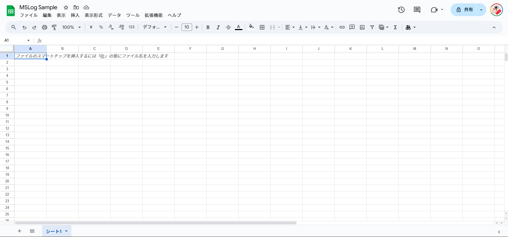

# M5 Log

*Created by ChatGPT*

M5Stackのデータをスプレッドシートに書き込むwebアプリケーション

## How to use
### What to prepare
 - Google Account
 - Google SpreadSheet
 - Google AppScript

### Process
**新しいスプレッドシートを作成する**


**スプレッドシートIDを取得する**
スプレッドシートに書き込むためにスプレッドシートIDを取得します

``https://docs.google.com/spreadsheets/d/1yU6Qhr4eEZoHE7I7XPVi4dZBV1OYhT-zu9OZdRx1ogk``

この場合 ``1yU6Qhr4eEZoHE7I7XPVi4dZBV1OYhT-zu9OZdRx1ogk``がIDとなります

**GoogleAppScriptを有効にする**
``拡張機能 > Apps Script``をクリックして、GoogleAppScriptの画面を開きます

**GoogleAppScriptのコードを書き込む**
``code.gs``に[このコード](/code.gs)を貼り付けてください
```js
function doPost(e) {
  var sheet = SpreadsheetApp.openById("<your-spreadsheet-id>").getSheetByName("<your-sheet-name>");
  
  try {
    var data = JSON.parse(e.postData.contents); 
    sheet.appendRow([new Date(), data.sensor1, data.sensor2, data.sensor3]);
    return ContentService.createTextOutput("Success").setMimeType(ContentService.MimeType.TEXT);
  } catch (error) {
    return ContentService.createTextOutput("Error: " + error).setMimeType(ContentService.MimeType.TEXT);
  }
}

```
これでスプレッドシート側の設定は完了です

**GoogleAppScriptをwebAPIとして公開する**

デプロイボタンから以下のファイルの通りウェブアプリとしてデプロイします

発行されたURLはコピーなどをして残して置いてください


**M5Stackにデータを送信するコードを書き込む**

これだけでは、データを書き込むことが出来ないのでM5Stackにデータを書き込みます。

データの書き込み方はあまり詳しく紹介はしません。Arduino IDEを使うのがオススメです。

この[コード](/send.cpp)を貼り付けて書き込んでください
```cpp
#include <WiFi.h>
#include <HTTPClient.h>

const char* ssid = "YOUR_SSID";
const char* password = "YOUR_PASSWORD";
const char* scriptURL = "YOUR_GAS_WEB_APP_URL";  //ここにウェブアプリURLを入力してください

void setup() {
  Serial.begin(115200);
  WiFi.begin(ssid, password);
  while (WiFi.status() != WL_CONNECTED) {
    delay(500);
    Serial.print(".");
  }
  Serial.println("\nWiFi connected");
}

void loop() {
  if (WiFi.status() == WL_CONNECTED) {
    HTTPClient http;
    http.begin(scriptURL);
    http.addHeader("Content-Type", "application/json");

    String jsonPayload = "{\"sensor1\": 23.5, \"sensor2\": 45.2, \"sensor3\": 78.9}";
    
    int httpResponseCode = http.POST(jsonPayload);
    Serial.println("Response: " + String(httpResponseCode));

    http.end();
  }
  delay(5000); 
```

**最後に**

以上で設定は終了です

これでスプレッドシートにデータを書き込むことができます

もし、なにかあれば[こちら](https://kemg-b9e0e.web.app/contact/)までお問い合わせください。

## CopyRight
&copy; 2025 Kenshiro TAMATA All right reserved